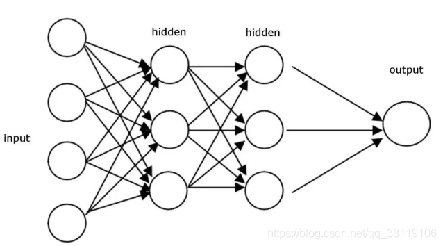
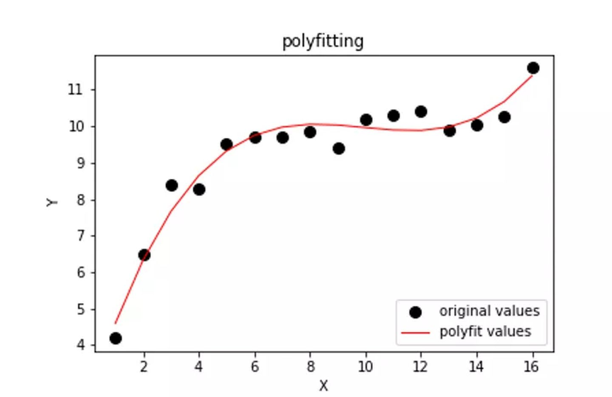
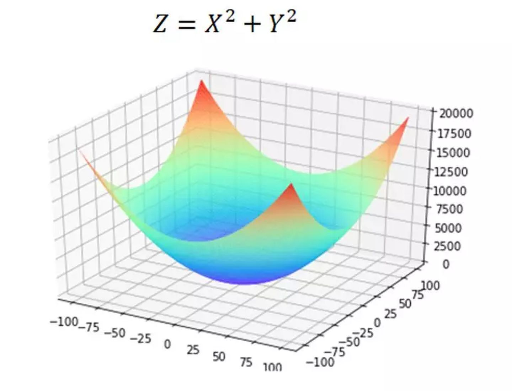
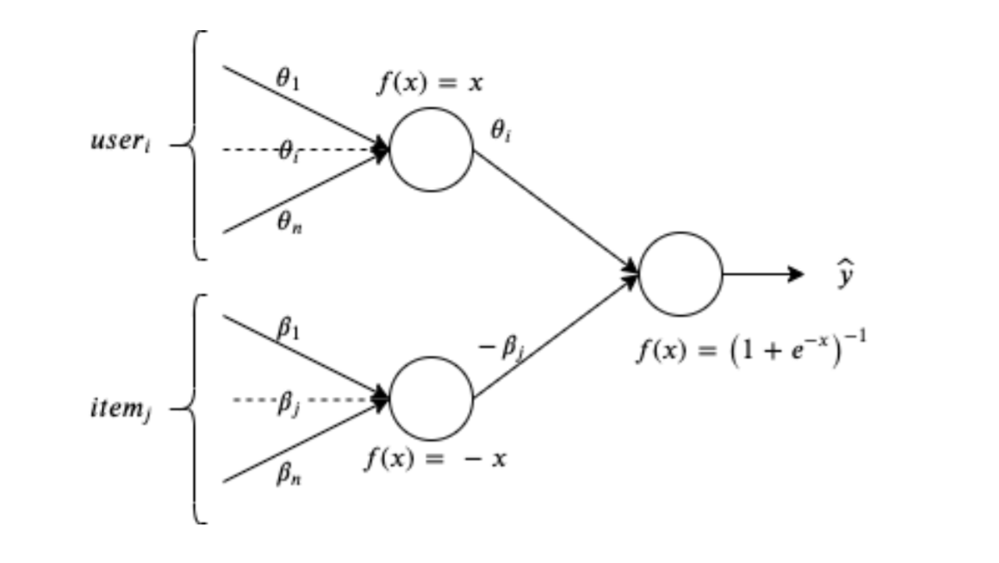

# Auto Generation of Diagnostic Assessments and their Quality Evaluation——论文阅读报告

[TOC]

## 1 阅读该论文前需要知道的小知识

### 1.1 一些名词：

- 基线测试(baseline  test)：baseline这个概念是作为算法提升的参照物而存在的，相当于一个基础模型，可以以此为基准来比较对模型的改进是否有效。在文中所提到的基线测试，是指一种通过设定基础模型，来对学生行为进行一些评估，并以此来生成诊断评估

- 数据集(dataset)：数据集是一组样本的集合。每一行数据集都包含一个活多个特征，此外还可能包含一个标签。用于机器学习中对模型的训练。

- 学习理论(Learning theory)：学习理论是一个重要的研究领域，它融合了心理学、教育学、神经科学和计算机等不同领域的见解，以模拟学生学习所教信息的效果。这是一种评估当前技能的有效方法

- IRT模型：IRT模型用来描述被试者能力和项目特性之间的关系。在现实生活中，由于被试者的能力不能通过可观测的数据进行描述，所以IRT模型用一个潜变量 θ 来表示，并考虑与项目相关的一组参数来分析正确回答测试项目的概率。应用于学习效果评估，试卷的设计与修改，测试信息函数，计算机自适应测试。

- 全连接层(Fully Connected Layer)：在卷积神经网络中，对一张图片进行识别的行为分为两个部分。全连接层之前的作用是提取特征，而全连接层的作用是分类。

- 热编码（One-Hot Encoding）：在机器学习算法中，我们经常会遇到分类特征，例如：人的性别有男女，祖国有中国，美国，法国等。这些特征值并不是连续的，而是离散的，无序的。通常我们需要对其进行**特征数字化。**  One-Hot编码是分类变量作为二进制向量的表示。这首先要求将分类值映射到整数值。然后，每个整数值被表示为二进制向量，除了整数的索引之外，它都是零值，它被标记为1。

### 1.2 IRT模型：

​		作为该论文用于评估的最主要手段，我认为有必要专门介绍一下该模型。

​		在IRT模型出现之前，曾有过经典测量理论CCT。

​		但是经典测量理论却有一些难以克服的缺点：

- **能力与观测分数之间的线性关系假设不合理。**
  在经典测量理论中认为被试的能力与测试得到的分数是线性关系的，但是在实际情况中往往不程线性关系。比如我们在进行考试时，想要从50分考到60分很容易，但是想要从90分考到100分却很难。
- **被试的测验结果依赖于所施测项目的难度。**
  被试由于做难易不同的题目而得到不同的分数，在经典测量理论中不同的分数表示不同的能力，这与常理不符。被试的能力不应由于所测题目的难度不同而不同，即，被试的能力应于所测题目的难度无关。

- **无法提供能力不同的被试如何对项目做出反应。**
  对于已知能力的被试以及已知相关参数的题目，经典测量理论无法给出被试做该道题目的正确或错误概率

​		项目反应理论起源于 20 世纪三十年代，它是针对 CTT 所具有的不足而提出的，其基本思想是建立被试的潜在能力及其在项目上的作答反应之间的关系模型，即项目反应模型。它与经典测量理论相比，具有如下优点：

- **参数具有不变性。**

  在项目反应理论下，项目的难度参数、区分度参数及被试的能力参数具有不变性。

- **被试的能力水平与项目参数之间关联化、模型化。**
  在 IRT 中引入了项目特征曲线，这将项目难度、项目区分度以及被试的能力进行了有机的统一。

- **IRT 定义了信息函数。**
  IRT 中的信息函数反映了在不同的能力水平处，每个项目所提供的信息量的大小，信息量最大处的能力水平估计误差最小。

- **被试的能力参数与项目的难度参数具有配套性。**
  被试的能力参数与项目的难度参数是定义在同一个量表上的，当一个被试的能力参数已知时，配一个项目参数已知的测验，即可预测被试的正确反应概率。

​		IRT模型是用于评估被试对某一项目或某一类项目的潜在特质。同时，IRT模型建立在一定的假设之下：

- 单维性假设，即假设某个测验只测量被试的某一种能力。
- 立性假设，即假设被试在每一个项目上的作答反应是相互独立，互不影响的，作答反应只与被试自身的能力水平有关，与其他元素无关。
- 模型假设，即被试在项目上的正确反应概率与被试的能力水平有一定的函数关系。

​		目前常见的IRT模型有2-PL模型和3-PL模型。该论文中用到的是2-PL模型，其具体表达式如下
$$
p_{i,j}(θ_i)=\frac{1}{1+exp[−D_{aj}(θ_i−b_j)]}
$$
​		其种 θi 是被试者能力的参数，aj和 bj 分别代表的是题目的区分度参数和难度参数，D是为1.7的常数。

​		

### 1.3 全连接神经网络：

​		全连接神经网络也被也称作多层感知机（MLP）

​		全连接神经网络是CNN，RNN，LSTM等神经网络的基础，他们都是从全连接神经网络发展而来的，最基础的原理都是由反向传播而来。

​		一个最基础的全连接神经网络包括以下结构

​		对，就是这么一个东西，左边输入，中间计算，右边输出。

​		不算输入层，上面的网络结构总共有两层，隐藏层和输出层，每一级都是利用前一级的输出做输入，再经过圆圈内的组合计算，输出到下一级。

​		一个完整的全连接神经网络，包括正向传播以及反向传播。正向传播即一个输入完整经过隐藏层，再到输出层的一个过程。

​		在提到反向传播之前，我们首先需要知道，神经网络的训练是有监督的学习，也就是输入X有着与之对应的真实值Y，神经网络的输出Y与真实值Y之间的损失Loss就是网络反向传播的东西。整个神经网络的训练过程就是不断缩小损失Loss的过程。

​		比如我们为了求解一个问题，列出一个方程
$$
Loss=\sum_{i=1}^{n}({Aw^2+Bb^2+Cwb-Db-Ew+F})
$$
​		我们可以看到，这个方程中，A,B,C,D,E,F都是常数，w和b是未知数。为了让Loss尽量小，我们应当求解出最小的w和b。我们假设这是一个二维空间，那么我们就相当于是去寻找一条直线，让它与坐标轴上所有样本点距离最小。

​		我们可以将Loss 方程转化为一个三维图像求最优解的过程。三维图像就像一个“碗”，如图 4.6所示，它和二维空间的抛物线一样，存在极值，那我们只要将极值求出，那就保证了我们能求出最优的也就是这个“碗底”的坐标，使Loss 最小。

​		我们去求Loss的值的过程，就被称为***梯度下降求解法***，整个过程就像是从山顶不断向下，寻找可以最快去往山脚的路径。我们每“走一步”，都会寻找当前路径下的梯度，即当先位置上"最陡峭的地方"。这样我们不断地往下走（迭代），当我们逐渐接近山底的时候，每次更新的步伐也就越来越小，损失值也就越来越小，直到达到某个阈值或迭代次数时，停止训练，这样找到就是我们要求的解。

​		

## 2 论文正文导读

### 2.1  一个好的诊断性评估包括：

- 通过一个技巧集去区分不同能力的学生
- 与基本事实数据一致
- 尽可能少的评估问题即可达到目的

​		本篇论文阐述了一种实现这些目标的方法，这是通过从问题数据库中选择问题并根据给定的可配置策略组合起来以创建诊断性试卷来实现的。

​		通过考虑基于问题的多个属性的方法以及基线政策，论文的作者们开发了一系列指标来评估政策，并使用在线学习平台为来评估的学生提供访问历史数据。同时以平台上的一部分用户作为试点测试来进行评估。

​		作者表示，他们的评估方式，与基线政策相比。能够更好地通过诊断测试来评估学生的能力，也许这归功于更大的数据集。同时，在线上平台的随机试点测试数据显示，与基线测试相比，他们的诊断测试有着更好地辨别能力。

​		

### 2.2 评估学生能力的基本方式:

​		论文中提到，我们在评估一个未知水平的学生的水平时。最常见的形式是一张卷子。一个好的测试应该是具有特定特征的准确性的:试卷应该能够准确地诊断能力水平的学生技能的评价，它应该能够区分不同能力的学生。此外，它应该在满足这些目标的前提下，使用尽可能少的问题。

​		一份可以评判学生能力的卷子，不应该只有简单的“true or false”，而应当像我们从小到大做的卷子一样，通过从词库中抽选题目，来配置一份问卷。然后我们可以根据准确性和分辨力的标准来评估生成的试卷，从而决定策略的优劣。

​		实际上我们的高考卷就是一种"希望尽可能准确评估学生能力的一份卷子"。

### 2.3 将问题公式化:

​		为了进行分析，我们首先需要一个变量：***学生的能力***，我们首先将建立一个问题的数据库。对于数据库中的每一个问题，都拥有以下参数：辨别因子、难度级别、章节编号(代表问题来自于教学大纲中的章节编号)和该问题的学生行为数据。

​		每个问题的难度等级和章节编号都由专家标注，与学生反馈的相关数据通过平台收集。对于每个学生的评估，都由**能力和辨别因素参数**来确定（这个数据通过拟合后的IRT模型获取）

​		标准的IRT模型给出了能力和难度之间的关系，基于一个或多个参数，并预测学生正确回答问题的可能性。该论文使用2PL IRT模型来校准和评估他们生成的试卷。

​		该论文具体使用的2PL IRT模型公式如下:
$$
P(X = 1|θ, α, β) = \frac {e^{α(θ−β)}}{1 + e^{α(θ−β)}}
$$
​		这里，θ代表学生的技能/能力水平，α代表问题的判别因子，β代表问题的难度水平，P代表学生正确回答的概率

​		之后再将这一模型公式中的参数（α， β， θ）拟合出一个全连接深度神经网络。神经网络的输入是学生和问题向量的一种热编码（One-Hot Encoding），输出是学生对该问题的回答的正确性，这是一个二进制值。

​		上图为1PL IRT模型的深度神经网络结构。其他IRT模型可以使用相同的模板实现。

​		

​		我们选择最优问题集来形成测试的问题可以这样建模:设a是一个大小为n1, n2，…的k维张量。该张量的每一项都是0或1，表示是否对具有特定属性集的问题进行抽样。这个张量的每个维度代表一个问题属性，比如章节编号、难度等级等。

​		

​		当我们的所有条件都满足时，我们就得到了一个结果为0的目标函数。这就是一个包含所有所有问题属性的约束结果。如何通过大的数据集去针对每一个学生去生成一份卷子，就是上面所述的全连接神经网络所需要的做的事。

​		以上过程，解决了目标函数在处理领域约束上的问题，他可以与其他基于IRT的测试设计相结合。

### 2.4 生成试卷

​		为了生成一份试卷，我们提出了一组候选策略来从数据集中选择问题，并将这些问题组合成一份试卷，所有的问题是从课程大纲的每个领域中选择的。

​		基于2.3中的定理，我们选择了具有不同难度的问题。根据这些策略在区别学生方面的效果来评估这些策略。评估每个策略,我们测量参数,比如获得的成绩不同的学生在测试和诊断能力的学生与通过统计方法得到的他们真实水平的差值。然后，我们选择最佳策略生成一份试卷，通过使用我们提供真实数据集的在线学习平台，在真实世界的一组学生中进行测试，以验证我们的模型。

#### 2.4.1  基线策略(Baseline policy)

​		作为基线，我们在确保难度水平和教学大纲覆盖范围混合后，通过随机选择其他问题属性，从基准数据集中选择N个问题。这些问题的选择成为我们的标准基线。

#### 2.4.2  辨识政策 (Discrimination only policy)

​		我们使用由拟合的2PL IRT模型推导出的判别参数值。我们选择的问题，与困难程度的混合，和区别因素的最高值为每个给定的困难程度。我们从基准数据集中选取了N道题，既保证了大纲的覆盖范围(每个章节至少有一道题)，又保证了问题的整体判别因子最大化。

#### 2.4.3 辨识+行为政策(Discrimination+behavior policy)

​		在这个政策中，我们结合了行为参数，歧视，困难和教学大纲覆盖范围，而选择问题。行为参数是指学生在考试时的行为，由学习平台捕捉。这些参数包括可能回答得太快或不正确的问题的数量，或者回答得太慢但正确的问题，等等。根据回答该问题的学生表现最多的参数进行标注，并从每个参数中选择最热门的问题。

​		

### 2.5 质量评估标准

​		为了对生成的试卷进行评价，我们采用了两个标准:准确性和辨识度。

​		准确性是指通过学生对试卷的反应判断出的能力与学生的实际能力有多接近。我们使用基准数据集和推断能力之间的RMSE作为精度的度量。

​		辨识衡量的是考卷在区分不同能力学生方面的成功程度。我们从我们的基准数据集对M个学生(评估学生集)的子集生成的试卷的准确性和判别性进行评估。我们用分数的散布和分布来衡量辨识度。

## 3 个人对论文应用价值的看法

​		个人认为该论文的应用场景是十分广阔的，本文围绕生成学生的能力评估报告展开。

​		但其中的方法论，对于其他各种行业，人群的评估同样有效。

​		个人认为，该方法最核心的难点在于“基准数据集”的建立，以及有效的反馈和提交平台的建立。需要大量的人力和物力的积累才能得到让人满意的结果。但是该论文所提到的方法具有较强的可拓展性，可在初期的构建上不断地添置内容。可先通过较少的数据量，得到一个一般情况下的解。再通过不断地更新内容来获取更好地解。

