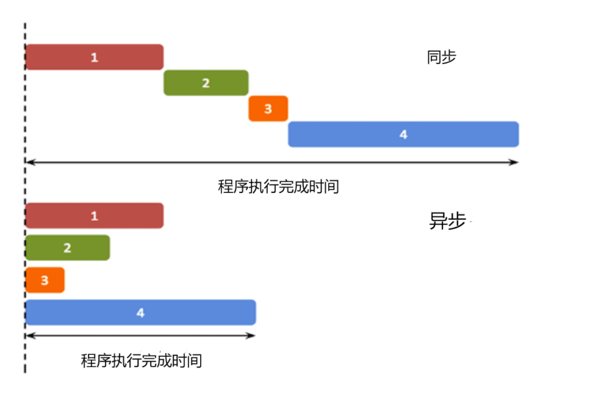

# JavaScript学习笔记


## 1 JavaScript简介

 		JavaScript是互联网上最流行的脚本语言，这门语言可用于HTML和web，更可广泛用于服务器、PC、笔记本电脑、平板电脑和智能手机等设备。


### 1.1 JavaScript 是脚本语言

- JS是一种轻量级的编程语言
- JS是可插入HTML界面的编程代码
- JS插入HTML页面后，可由所有的现代浏览器执行
- JS很容易学习


### 1.2 JavaScript可以实现的部分功能


#### 1.2.1  直接写入 HTML 输出流

```javascript
<!DOCTYPE html>
<html>
<head>
<meta charset="utf-8">
<title>菜鸟教程(runoob.com)</title>
</head>
<body>
	
<p>
JavaScript 能够直接写入 HTML 输出流中：
</p>
<script>
document.write("<h1>这是一个标题</h1>");
document.write("<p>这是一个段落。</p>");
</script>
<p>
您只能在 HTML 输出流中使用 <strong>document.write</strong>。
如果您在文档已加载后使用它（比如在函数中），会覆盖整个文档。
</p>
	
</body>
</html>

//演示地址↓
//https://www.runoob.com/try/try.php?filename=tryjs_intro_document_write
```


#### 1.2.2  对事件的反应

````javascript
<!DOCTYPE html>
<html>
<head> 
<meta charset="utf-8"> 
<title>菜鸟教程(runoob.com)</title> 
</head>
<body>
	
<h1>我的第一个 JavaScript</h1>
<p>
JavaScript 能够对事件作出反应。比如对按钮的点击：
</p>
<button type="button" onclick="alert('欢迎!')">点我!</button>
	
</body>
</html>

//演示地址↓
//https://www.runoob.com/try/try.php?filename=tryjs_intro_alert
````


#### 1.2.3 改变HTML内容


````javascript
<!DOCTYPE html>
<html>
<head> 
<meta charset="utf-8"> 
<title>菜鸟教程(runoob.com)</title> 
</head>
<body>
	
<h1>我的第一段 JavaScript</h1>
<p id="demo">
JavaScript 能改变 HTML 元素的内容。
</p>
<script>
function myFunction()
{
	x=document.getElementById("demo");  // 找到元素
	x.innerHTML="Hello JavaScript!";    // 改变内容
}
</script>
<button type="button" onclick="myFunction()">点击这里</button>
	
</body>
</html>

//演示地址↓
//https://www.runoob.com/try/try.php?filename=tryjs_intro_inner_html
````


#### 1.2.4  改变HTML 图像

````javascript
<!DOCTYPE html>
<html>
<head> 
<meta charset="utf-8"> 
<title>菜鸟教程(runoob.com)</title> 
</head>
<body>
	
<script>
function changeImage()
{
	element=document.getElementById('myimage')
	if (element.src.match("bulbon"))
	{
		element.src="/images/pic_bulboff.gif";
	}
	else
	{
		element.src="/images/pic_bulbon.gif";
	}
}
</script>

<p>点击灯泡就可以打开或关闭这盏灯</p>
	
</body>
</html>

//演示地址↓
//https://www.runoob.com/try/try.php?filename=tryjs_lightbulb
````


#### 1.2.5 改变 HTML 样式

````javascript
<!DOCTYPE html>
<html>
<head> 
<meta charset="utf-8"> 
<title>菜鸟教程(runoob.com)</title> 
</head>
<body>
	
<h1>我的第一段 JavaScript</h1>
<p id="demo">
JavaScript 能改变 HTML 元素的样式。
</p>
<script>
function myFunction()
{
	x=document.getElementById("demo") // 找到元素
	x.style.color="#ff0000";          // 改变样式
}
</script>
<button type="button" onclick="myFunction()">点击这里</button>
	
</body>
</html>

//演示地址↓
//https://www.runoob.com/try/try.php?filename=tryjs_intro_style
````


#### 1.2.6  JavaScript：验证输入

```javascript
<!DOCTYPE html>
<html>
<head> 
<meta charset="utf-8"> 
<title>菜鸟教程(runoob.com)</title> 
</head>
<body>
	
<h1>我的第一段 JavaScript</h1>
<p>请输入数字。如果输入值不是数字，浏览器会弹出提示框。</p>
<input id="demo" type="text">
<script>
function myFunction()
{
	var x=document.getElementById("demo").value;
	if(x==""||isNaN(x))
	{
		alert("不是数字");
	}
}
</script>
<button type="button" onclick="myFunction()">点击这里</button>
	
</body>
</html>

//演示地址↓
//https://www.runoob.com/try/try.php?filename=tryjs_intro_validate
```


## 2 NPM使用入门


### 2.1 NPM是什么

​		`NPM（node package manager）`，通常被称为`node`包管理器。顾名思义，它的主要功能就是管理理`node`包,包括:安装,卸载,更新,查看,搜索,发布等.

​		`npm`的背后,是基于`couchdb`的一个数据库,详细记录了每个包的信息,包括作者,版本,依赖,授权信息等.它的一个很重要的作用就是:将开发者从繁琐的包管理工作中解放出来,更加注重于功能的开发.


### 2.2 npm包安装模式

​			在介绍`npm`包的管理之前,我们首先得了解一下`npm`包的两种安装模式

`node`包的安装分为两种:

- 本地安装:package会被下载到当前缩在目录,也只能在当前目录下使用.
- 全局安装:package会被下载到特定的系统目录下,安装的package能够在所有目录下使用

**本地安装:**

>  npm install <Module Name> 


**全局安装:**

> npm install -g  <Module Name>


**查看安装信息:**

> npm list -g      //查看全局安装的模块

> npm list  <Module Name>   //查看摸个模块的安装信息


### 2.3 npm包的管理

​		`npm`包的管理命令主要包括几个动作:安装,卸载,更新,搜索,发布等

​		安装的内容已在2.2中阐述,不再赘述


#### 2.3.1 **卸载模块**

> npm uninstall  <Module Name>


#### 2.3.2 **更新模块**

> npm update <Module Name>


#### 2.3.3 **搜索模块**

> npm  search <Module Name>


### 2.4 npm常用命令

​		`npm`提供了很多命令,例如install和publish,使用`npm help`可查看所有命令

- 使用`npm help <command>` 可查看某条命令的详细帮助,例如`npm help install`.
- 使用`npm update <package> `可以把当前目录下node_modules子目录里边的对应模块更新至最新版本
- 使用`npm update <packgae> -g`可以把全局安装的对应命令行程序更新至最新版.


### 2.5 配置npm源

​		当我们默认使用npm官网下载模块时,由于网络的原因,会导致我们的下载速度特别慢.所以,我们可以配置一些国内的镜像来加快我们的下载速度.以下说明淘宝的npm镜像使用方法

**首先使用淘宝定制的cnpm命令行工具代替默认的npm:**

> ```
> npm install -g cnpm --registry=https://registry.npm.taobao.org
> ```

**之后我们就可以通过使用cnpm命令来安装模块了:**

> ```
> cnpm install [name]
> ```


## 3 this关键字

在面向对象语言中.this表示当前对象的一个引用.

但在JavaScript中`this`不是固定不变的,他会随着执行环境的改变而改变:

-  在方法中,`this`表示该方法所属的对象
- 如果单独使用,`this`表示全局对象
- 在函数中,`this`表示全局对象
- 在函数中,在严格模式下,`this`是未定义的
- 在事件中,`this`表示接收事件的元素
- 类似`call()`和`apply()`方法可以将this引用到任何对象


### 3.1 单独使用this

单独使用 this，则它指向全局(Global)对象。

在浏览器中，window 就是该全局对象为 [**object Window**]:

```javascript
var x = this;
```

严格模式下，如果单独使用，this 也是指向全局(Global)对象。

```javascript
"use strict";
var x = this;
```


### 3.2  函数中使用this

在函数中，函数的所属者默认绑定到 this 上。

在浏览器中，window 就是该全局对象为 [**object Window**]:

```javascript
function myFunction() {  
		return this; 
}
```


### 3.3 事件中的this

在 HTML 事件句柄中，this 指向了接收事件的 HTML 元素：


```javascript
<button onclick="this.style.display='none'">
点我后我就消失了
</button>
```


### 3.4  对象方法中绑定

下面实例中，this 是 person 对象，person 对象是函数的所有者：

```javascript
var person = {
  firstName  : "John",
  lastName   : "Doe",
  id         : 5566,
  myFunction : function() {
    return this;
  }
};
```


### 3.5 显式函数绑定

在 JavaScript 中函数也是对象，对象则有方法，apply 和 call 就是函数对象的方法。这两个方法异常强大，他们允许切换函数执行的上下文环境（context），即 this 绑定的对象。

在下面实例中，当我们使用 person2 作为参数来调用 person1.fullName 方法时, **this** 将指向 person2, 即便它是 person1 的方法：

```javascript
var person1 = {
  fullName: function() {
    return this.firstName + " " + this.lastName;
  }
}
var person2 = {
  firstName:"John",
  lastName: "Doe",
}
person1.fullName.call(person2);  // 返回 "John Doe"
```


## 4 JavaScript中的变量作用域


首先需要注意几点:

- JavaScript中的对象和函数同样也是变量
- 函数体内部，局部变量的优先级比同名的全局变量高
- 在 JavaScript 中, 作用域为可访问变量，对象，函数的集合
- 函数中声明的变量在整个函数中都有定义
- 未使用var关键字定义的变量都是全局变量
- 全局变量都是window对象的属性


**变量作用域分为三类:**

- 全局作用域
- 函数作用域
- 块级作用域(一个{...}大括号内的代码块,就称为一个块级)


### 4.1 JavaScript的局部作用域和全局变量


#### 4.1.1 **局部作用域:**

变量在函数内声明,变量为局部作用域.

局部变量:只在函数内部访问

```javascript
// 此处不能调用 carName 变量
function myFunction() {
    var carName = "Volvo";
    // 函数内可调用 carName 变量
}
```

因为局部变量只作用于函数内，所以不同的函数可以使用相同名称的变量。

局部变量在函数开始执行时创建，函数执行完后局部变量会自动销毁。


#### 4.1.2 全局变量

变量在函数外定义，即为全局变量。

全局变量有全局作用域:网页中所有脚本和函数均可使用

```javascript
var carName = " Volvo";
 
// 此处可调用 carName 变量
function myFunction() {
    // 函数内可调用 carName 变量
}
```

如果变量在函数内没有声明（没有使用 var 关键字），该变量为全局变量。

以下实例中 carName 在函数内，但是为全局变量。

```javascript
// 此处可调用 carName 变量
 
function myFunction() {
    carName = "Volvo";
    // 此处可调用 carName 变量
}
```

### 4.2 JavaScript 变量生命周期

JavaScript 变量生命周期在它声明时初始化。

局部变量在函数执行完毕后销毁。

全局变量在页面关闭后销毁。


### 4.3 JavaScript中的作用域链

首先看以下代码:

```javascript
<script type="text/javascript">
    var rain = 1;
    function rainman(){
        var man = 2;
        function inner(){
            var innerVar = 4;
            alert(rain);
        }
        inner();    //调用inner函数
    }
    rainman();    //调用rainman函数
</script>
```

​		

​		JavaScript首先在inner函数中查找是否定义了变量rain，如果定义了则使用inner函数中的rain变量；如果inner函数中没有定义rain变量，JavaScript则会继续在rainman函数中查找是否定义了rain变量，在这段代码中rainman函数体内没有定义rain变量，则JavaScript引擎会继续向上（全局对象）查找是否定义了rain；在全局对象中我们定义了rain = 1，因此最终结果会弹出'1'。


​		作用域链：JavaScript需要查询一个变量x时，首先会查找作用域链的第一个对象，如果以第一个对象没有定义x变量，JavaScript会继续查找有没有定义x变量，如果第二个对象没有定义则会继续查找，以此类推。


​		像是一个箱子,但是是从里向外一层一层剥开的方式,去寻找我们需要的对象.在理解上比较类似于栈或是由底至顶的递归方式.


### 4.4 JavaScript的函数中声明的变量在整个函数中都有定义

首先看一段代码:

```javascript
<script type="text/javascript">
    function rain(){
        var x = 1;
        function man(){
            x = 100;
        }
        man();        //调用man
        alert( x );    //这里会弹出 100
    }
    rain();    //调用rain
</script>
```

上面的代码说明，变量x在整个rain函数体内都可以使用，并可以重新赋值。

再看一个例子

```javascript
<script type="text/javascript">
    var x = 1;
    function rain(){
        alert( x );        //弹出 'undefined'，而不是1
        var x = 'rain-man';
        alert( x );        //弹出 'rain-man'
    }
    rain();
</script>
```

​		是由于在函数rain内局部变量x在整个函数体内都有定义（ var x= 'rain-man'，进行了声明），所以在整个rain函数体内隐藏了同名的全局变量x。这里之所以会弹出'undefined'是因为，第一个执行alert(x)时，局部变量x仍未被初始化。

​		上面的rain函数等同于下面的函数：

```javascript
function rain(){
    var x;
    alert( x );
    x = 'rain-man';
    alert( x );
}
```

## 5  在介绍Promise函数与async函数之前:异步编程


### 5.1 异步的概念

异步（Asynchronous, async）是与同步（Synchronous, sync）相对的概念

在传统的单线程变成中,程序的运行的同步的.而异步则不保证同步.也就是说,一个异步过程的执行将不再与原有的序列有顺序关系.




### 5.2 什么时候用异步编程

在一个前端的界面中,我们通常需要去处理一些简短,快速的操作.但是当我们的一个界面存在多个同时进行的操作时,如果我们采用同步的方式去编写.就会出现一种情况"当一个事件没有结束时,界面将无法处理其他请求."

现在有一个按钮，如果我们设置它的 onclick 事件为一个死循环，那么当这个按钮按下，整个网页将失去响应。

为了解决这个问题，JavaScript 中的异步操作函数往往通过回调函数来实现异步任务的结果处理。

事实上,异步编程无处不在.我们PC上的操作系统就是一个很好的例子.


## 6 JavaScript Promise函数

在传统的情况下,我们书写较为复杂的异步任务时,几乎是不可避免的会写成多层嵌套的形式.这不论是对于后期的维护还是异常处理都是一件特别麻烦的事,而且会让缩进格式变得非常冗赘.

```javascript
setTimeout(function () {
    console.log("First");
    setTimeout(function () {
        console.log("Second");
        setTimeout(function () {
            console.log("Third");
        }, 3000);
    }, 4000);
}, 1000);
```

在同样的情况下,使用Promise函数写的话是这样子的:

````javascript
new Promise(function (resolve, reject) {
    setTimeout(function () {
        console.log("First");
        resolve();
    }, 1000);
}).then(function () {
    return new Promise(function (resolve, reject) {
        setTimeout(function () {
            console.log("Second");
            resolve();
        }, 4000);
    });
}).then(function () {
    setTimeout(function () {
        console.log("Third");
    }, 3000);
});
````

我们可以看到,虽然这个代码变得长了许多.但是在理解上的难度是降低了.显然这样的做法更加的符合设计模式的基本准则.


### 6.1 Promise函数的使用

Promise 构造函数只有一个参数，是一个函数，这个函数在构造之后会直接被异步运行，所以我们称之为起始函数。起始函数包含两个参数 resolve 和 reject。

当 Promise 被构造时，起始函数会被异步执行：

```javascript
new Promise(function (resolve, reject) {
    console.log("Run");
});
```

这段程序会直接输出 **Run**。

resolve 和 reject 都是函数，其中调用 resolve 代表一切正常，reject 是出现异常时所调用的：

```javascript
new Promise(function (resolve, reject) {
    var a = 0;
    var b = 1;
    if (b == 0) reject("Diveide zero");
    else resolve(a / b);
}).then(function (value) {
    console.log("a / b = " + value);
}).catch(function (err) {
    console.log(err);
}).finally(function () {
    console.log("End");
});
```

这段代码执行结果为

> a / b = 0
>
> End

Promise 类有 .then() .catch() 和 .finally() 三个方法，这三个方法的参数都是一个函数，.then() 可以将参数中的函数添加到当前 Promise 的正常执行序列，.catch() 则是设定 Promise 的异常处理序列，.finally() 是在 Promise 执行的最后一定会执行的序列。 .then() 传入的函数会按顺序依次执行，有任何异常都会直接跳到 catch 序列：

```javascript
new Promise(function (resolve, reject) {
    console.log(1111);
    resolve(2222);
}).then(function (value) {
    console.log(value);
    return 3333;
}).then(function (value) {
    console.log(value);
    throw "An error";
}).catch(function (err) {
    console.log(err);
});
```

执行结果

> 1111
> 2222
> 3333
> An error


## 6 JavaScript 闭包

JavaScript 变量可以是局部变量或全局变量。

闭包就是一个函数引用另一个函数的变量，因为变量被引用着所以不会被回收，因此可以用来封装一个私有变量。这是优点也是缺点，不必要的闭包只会增加内存消耗。

或者说闭包就是子函数可以使用父函数的局部变量，还有父函数的参数。


首先我们抛出一种情况:

```javascript
function add() {
    var counter = 0;
    return counter += 1;
}
 
add();
add();
add();

// 本意是想输出 3, 但事与愿违，输出的都是 1 !
```

这个情况下,我们就可以用到JavaScript中的闭包去处理这一问题:

```javascript
var add = (function () {
    var counter = 0;
    return function () {return counter += 1;}
})();
 
add();
add();
add();
 
// 计数器为 3
```

在这段代码中,变量 **add** 指定了函数自我调用的返回字值。

自我调用函数只执行一次。设置计数器为 0。并返回函数表达式。

add变量可以作为一个函数使用。

JavaScript 闭包使得函数拥有私有变量变成可能。

计数器受匿名函数的作用域保护，只能通过 add 方法修改。


## 7 JavaScript Generator函数


### 7.1 JavaScript Generator是什么

generators 是可以控制 iterator（迭代器）的函数。并在任何时候都可以暂停和恢复。

在Javascript中，一个函数一旦开始执行，就会运行到最后或遇到return时结束，运行期间不会有其它代码能够打断它，也不能从外部再传入值到函数体内

而Generator函数（生成器）的出现使得打破函数的完整运行成为了可能，其语法行为与传统函数完全不同

以一个循环为例:

```javascript
for (let i = 0; i < 5; i += 1) {
  console.log(i);
}
// 将会立即输出 0 -> 1 -> 2 -> 3 -> 4
```

当我们用generator函数改写后的呈现效果为:

```javascript
function * generatorForLoop(num) {
  for (let i = 0; i < num; i += 1) {
    yield console.log(i);
  }
}

const genForLoop = generatorForLoop(5);

genForLoop.next(); // 首先 console.log —— 0
genForLoop.next(); // 1
genForLoop.next(); // 2
genForLoop.next(); // 3
genForLoop.next(); // 4
```

这段代码做了什么呢？实际上，它只是做了一些修改来包装上面的 **for** 循环。但是最主要的变化是，它不会立即执行。这是 generator 中最重要的特性 — 我们可以在真正需要下一个值的时候，才去获取它，而不是一次获得所有值。


### 7.2 Generator 语法

如何声明一个 generator 函数呢？我们有很多方法可以实现，但是最主要的是在函数关键字之后添加一个星号。

```javascript
function * generator () {}
function* generator () {}
function *generator () {}

let generator = function * () {}
let generator = function* () {}
let generator = function *() {}

let generator = *() => {} // SyntaxError
let generator = ()* => {} // SyntaxError
let generator = (*) => {} // SyntaxError
```

从上面的示例中可以看出，我们不能使用箭头函数来创建一个 generator。

接下来 —— generator 作为一种方法。它的声明方式与函数相同。

```javascript
class MyClass {
  *generator() {}
  * generator() {}
}

const obj = {
  *generator() {}
  * generator() {}
}
```


### 7.3  Yield的使用方法

现在，让我们来看看新的关键字 **yield**。它有点像 **return**，但不是。**return** 只在函数调用之后返回值，**return** 语句之后不允许你执行任何其他操作。

```javascript
function withReturn(a) {
  let b = 5;
  return a + b;
  b = 6; // 不会重新定义 b 了
  return a * b; // 永远不会返回新的值了
}

withReturn(6); // 11
withReturn(6); // 11
```

而 **yield** 的执行方式不同。

```javascript
function * withYield(a) {
  let b = 5;
  yield a + b;
  b = 6; // 第一次执行之后仍可以重新定义变量
  yield a * b;
}

const calcSix = withYield(6);

calcSix.next().value; // 11
calcSix.next().value; // 36
```

**yield** 只返回一次值，下次调用 **next()** 时，它将执行到下一个 **yield** 语句。

在 generator 中我们通常都会获得一个对象作为输出。它有两个属性 **value** 和 **done**。正如你所想，**value** 表示返回的值，**done** 告诉我们 generator 是否完成了它的工作（是否迭代完成）。

```javascript
function * generator() {
    yield 5;
}

const gen = generator();

gen.next(); // {value: 5, done: false}
gen.next(); // {value: undefined, done: true}
gen.next(); // {value: undefined, done: true} - 继续调用 next() 将返回相同的输出。
```

在 generator 中不仅可以使用 **yield**，**return** 语句也会返回相同的对象，但是当执行完第一个 **retrurn** 语句时，迭代就会停止了。

```javascript
function * generator() {
  yield 1;
  return 2;
  yield 3; // 这个 yield 永远都不会执行
}

const gen = generator();

gen.next(); // {value: 1, done: false}
gen.next(); // {value: 2, done: true}
gen.next(); // {value: undefined, done: true}
```


## 8 JavaScript async函数


### 8.1 async函数是什么

async被认为是异步操作的终极结局方案,一般上来说async就是Generator函数的语法糖

比如用Generator 函数去依次读取两个文件

```javascript
var fs = require('fs');

var readFile = function (fileName){
  return new Promise(function (resolve, reject){
    fs.readFile(fileName, function(error, data){
      if (error) reject(error);
      resolve(data);
    });
  });
};

var gen = function* (){
  var f1 = yield readFile('/etc/fstab');
  var f2 = yield readFile('/etc/shells');
  console.log(f1.toString());
  console.log(f2.toString());
};
```

但是写成async函数的形式,就是下面的样子

```javascript
var asyncReadFile = async function (){
  var f1 = await readFile('/etc/fstab');
  var f2 = await readFile('/etc/shells');
  console.log(f1.toString());
  console.log(f2.toString());
};
```

一比较就会发现，async 函数就是将 Generator 函数的星号（*）替换成 async，将 yield 替换成 await，仅此而已。


### 8.2 async函数的优点

async 函数对 Generator 函数的改进，体现在以下三点。

- **内置执行器。** Generator 函数的执行必须靠执行器，所以才有了 co 函数库，而 async 函数自带执行器。也就是说，async 函数的执行，与普通函数一模一样，只要一行。
- **更好的语义。** async 和 await，比起星号和 yield，语义更清楚了。async 表示函数里有异步操作，await 表示紧跟在后面的表达式需要等待结果。
- **更广的适用性。** co 函数库约定，yield 命令后面只能是 Thunk 函数或 Promise 对象，而 async 函数的 await 命令后面，可以跟 Promise 对象和原始类型的值（数值、字符串和布尔值，但这时等同于同步操作）。


### 8.3 async函数的实现

async 函数的实现，就是将 Generator 函数和自动执行器，包装在一个函数里。

```javascript
async function fn(args){
  // ...
}

// 等同于

function fn(args){ 
  return spawn(function*() {
    // ...
  }); 
}
```

所有的 async 函数都可以写成上面的第二种形式，其中的 spawn 函数就是自动执行器。


### 8.4 async函数的用法

同 Generator 函数一样，async 函数返回一个 Promise 对象，可以使用 then 方法添加回调函数。当函数执行的时候，一旦遇到 await 就会先返回，等到触发的异步操作完成，再接着执行函数体内后面的语句。

下面是一个例子

```javascript
async function getStockPriceByName(name) {
  var symbol = await getStockSymbol(name);
  var stockPrice = await getStockPrice(symbol);
  return stockPrice;
}

getStockPriceByName('goog').then(function (result){
  console.log(result);
});
```

上面代码是一个获取股票报价的函数，函数前面的async关键字，表明该函数内部有异步操作。调用该函数时，会立即返回一个Promise对象。

下面的例子，指定多少毫秒后输出一个值

```javascript
function timeout(ms) {
  return new Promise((resolve) => {
    setTimeout(resolve, ms);
  });
}

async function asyncPrint(value, ms) {
  await timeout(ms);
  console.log(value)
}

asyncPrint('hello world', 50);
```

上面代码指定50毫秒以后，输出"hello world"。


## 9  JavaScript 模块

在计算机程序的开发过程中，随着程序代码越写越多，在一个文件里代码就会越来越长，越来越不容易维护。

为了编写可维护的代码，我们把很多函数分组，分别放到不同的文件里，这样，每个文件包含的代码就相对较少，很多编程语言都采用这种组织代码的方式。在Node环境中，一个.js文件就称之为一个模块（module）。

使用模块有什么好处？

最大的好处是大大提高了代码的可维护性。其次，编写代码不必从零开始。当一个模块编写完毕，就可以被其他地方引用。我们在编写程序的时候，也经常引用其他模块，包括Node内置的模块和来自第三方的模块。

使用模块还可以避免函数名和变量名冲突。相同名字的函数和变量完全可以分别存在不同的模块中，因此，我们自己在编写模块时，不必考虑名字会与其他模块冲突。