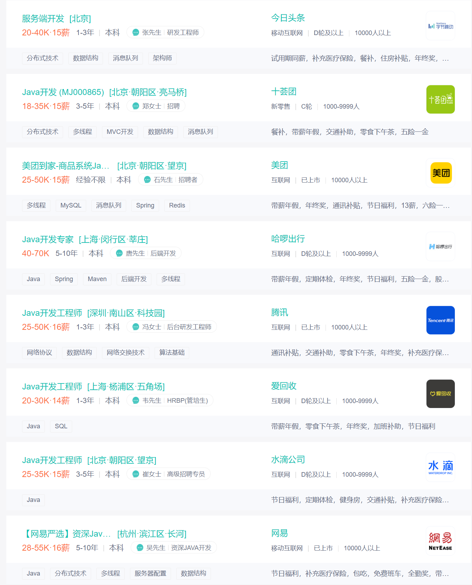
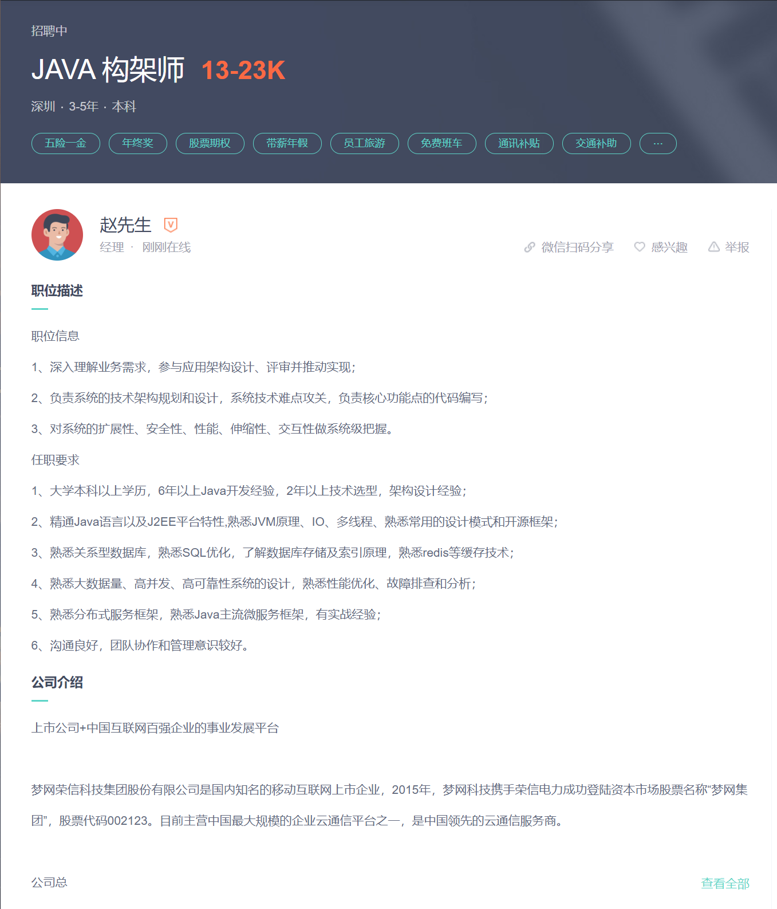
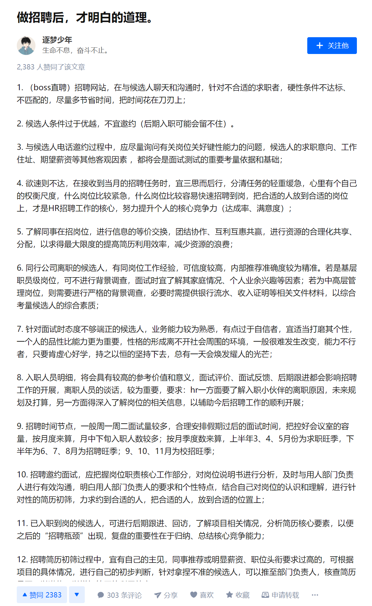
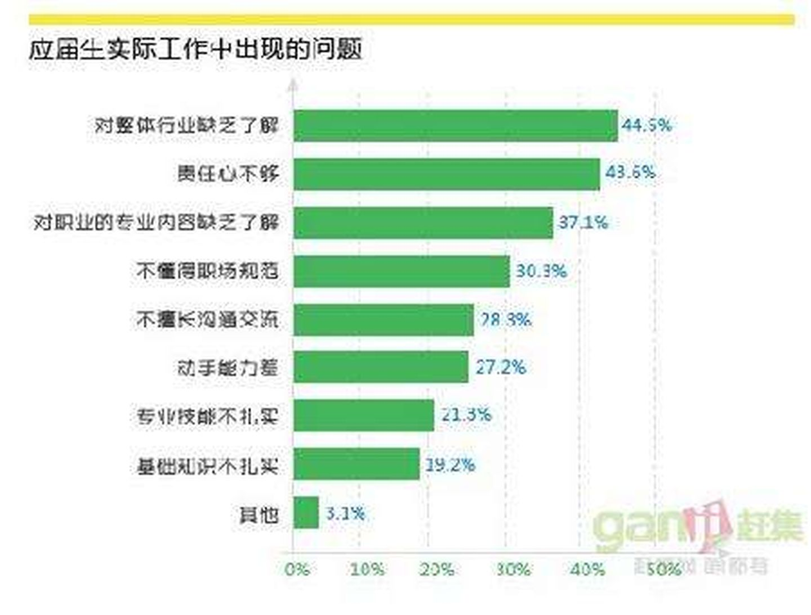

# 企业对应届生能力的主要要求以及主要的不满

## 主要要求

> 来源:https://www.zhipin.com/c100010000-p100101/d_203/?ka=sel-degree-203

作为一名计算学子,我想,先从熟悉的方面出发吧.

在BOSS直聘,以"JAVA"为关键字,限定条件"本科",搜索结果如上图所示.

从要求上来说,比较直观地能看到对于员工工作经验的要求,只有美团是对人员是没有工作经验的相关要求的,其他几家公司均要求在3年这个区间上.

对于一个企业来说,尤其是技术向的企业.了解一个来应聘的员工的最直接方式应该就是"你来自哪里,工作经验如何,做过什么项目?".

这对应届生来说十分的不友好,当然.这和绝大多数本科教育环境和工作环境几乎脱节有关.社会环境如此,无可厚非.

随便点进一家企业去看的话,

可以大致把这家企业对员工的能力上的要求归类为:

- 理解该职位的运行逻辑,并独立执行并实现过.并且成果能达到工业化的标准
- 对该行业的基础知识有较深的理解(精通JAVA,熟悉数据库,熟悉大数据.....)
- 具有团队合作的能力和精神

> 来源:https://www.zhipin.com/job_detail/9344b3395692cbc033d_2dm4FVQ~.html?ka=search_list_jname_51_blank&lid=aSc8o9GTfvj.search.51

然后我在知乎上搜索尝试了下,

有一个以HR视角,写下的文章.我觉得从需求提出方的角度出发,去思考某些需求的合理性,是一种有效且实际的角度."换位思考"嘛

> 地址:https://zhuanlan.zhihu.com/p/115881515

文章过长,不做全部内容的截图.

将内容总结后得到以下观点:

- 不宜追求对于公司条件来说太过优秀的人
- 可塑性强
- 个人爱好和家庭背景正常(虽然不算能力,但对于"招聘要求"来说并不难理解)
- 态度端正,品性优良.虚心好学,持之以恒.(对于一家希望长期发展的企业来说,自然也会希望收纳积极上进,热爱该行业的员工,在这种情况下,一个人的态度甚至比业务能力更为重要)
- 与公司的契合度(以计算机行业来说,某家公司一直以来都以GO语言为主要语言,这时有两名求职者,各方面水平都很接近.其中一名精通GO语言,另一名精通JAVA.这时从公司的运营成本出发,大概率会选择那一名精通GO语言的求职者)

总结一下个人觉得可以归结为**稳定**二字.

招一个人,对公司的业务拓展,业务维持的稳定.对公司的资金流稳定.对公司的人员流动和日常交流稳定.各种意义上的.

我觉得越大的企业越是如此.很少会有来一个人就动摇公司基本格局的情况,也不希望发生一个人的去留影响整个公司正常运作的情况.

## 主要的不满

几点在面试时的扣分点:

- **撒谎且无法自圆其说**
- **“挤牙膏”式回答问题**

> 来源:https://zhuanlan.zhihu.com/p/65948726

某企业讨厌应届毕业生的原因:

- **不稳定性极高。**

- **没经验，没技能。**
- **缺少最基础的职业素养。**

经常会有这样子的情况存在:学生A在应聘时,选择了某方向A,后来在公司进行了一段时间的工作后.发现自己的爱好其实是B.

每一个学生都是一个活生生的个体，都有着完全不同的背景经历和认知基础，但是对于未来的职业，非常多的应届生往往一无所知。对未来的职业是什么，具体要做什么，需要具备哪些技能，自己喜不喜欢完全不知道.

对个人来说,这样的一次求职的经历是为自己的未来试错,发现了自己的兴趣爱好.但对于企业来说,消耗了大量的时间和人力成本.

对于缺少经验和技能来说,这个倒也不能完全怪学生.本科的课程很多都是针对研究来制定的,在课程设置上学校很少思考企业真正需要什么样的员工,这一点在文科和经管类专业上体现的比理工科更加直接.

> 赶集网针对应届生的一份统计

> 来源:https://www.zhihu.com/question/24936755/answer/719576851

## 主要途径

招聘的六个渠道:

- 网络招聘
- 内部转介绍
- 人才市场和校园招聘
- 竞争对手挖人
- 人才档案
- 猎头公司

> 来源:https://zhuanlan.zhihu.com/p/138291380

《Kelly Services全球雇员指数调研》发布的调查称，中国雇员求职方式成功率排名依次为：1.招聘网站（38%）、2.“推荐”（25%）、3.“猎头（18%）、4.雇主主动挖角（12%）、5.线下会议（4%）、6.纸媒广告（3%）、7.由社交网络直接获得工作 （1%）。社交网络对传统求职招聘方式渗透日益加深，尤其排名第二的“推荐”、第三的“猎头”以及第四的“雇主主动挖角”，其总和已达到55%，这些方面受社交网络影响较大。广大雇主正是看到隐藏在其中的巨大潜力，将更多的招聘比重放在社会化招聘上面，发挥其多功能性，为企业带来更大的收益。

87%的中国企业招聘负责人认为雇主品牌对招聘工作影响很大。在他们眼里，最有效的营销渠道是职业社交网站（62%），其次是公司官网（57%）、亲友口碑（46%）、社交媒体（40%）等。企业在社交媒体上开通公共帐号，不仅可以发布相关的招聘信息，同时也可以在无形中树立自己的企业形象。联想公司在2011年在新浪微博上开通了公司的招聘主页“想招君”，至今已经发表了两千多篇微博、收获粉丝两万多人。微博内容除了职位招聘以外，还包括联想公司相关的新闻事件、以及公司内部的福利活动等等，还开辟了一个专栏--想招君的日常，在其中与大家分享在联想工作生活的点点滴滴，使企业形象生动活泼起来。

> 来源:https://www.lunwendata.com/thesis/2017/106131.html